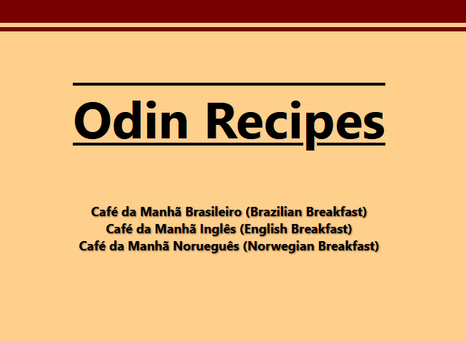

# Odin Recipes

> Um site de receitas simples.

## 🚀 Live Preview

**[Clique aqui para testar o projeto](https://elvismourab.github.io/odin-recipes/)**

## 📖 Descrição

Este projeto faz parte do currículo do [The Odin Project](https://www.theodinproject.com). O objetivo é aplicar os aprendizados básicos sobre HTML e CSS.

-> [Project: Recipes](https://www.theodinproject.com/lessons/foundations-recipes)

## ✨ Funcionalidades
-   Uma lista de receitas de café da manhã tradicional de alguns países, com uma descrição, ingredientes e passo-a-passo para cada receita.

## 🛠️ Tech Stack
-   HTML
-   CSS

## 🧠 O que aprendi

- Estrutura básica html e aplicação do css.

## 💻 Como Executar Localmente

1.  Clone o repositório.
2.  Entre no diretório.
3.  Abra o `index.html` no navegador.
